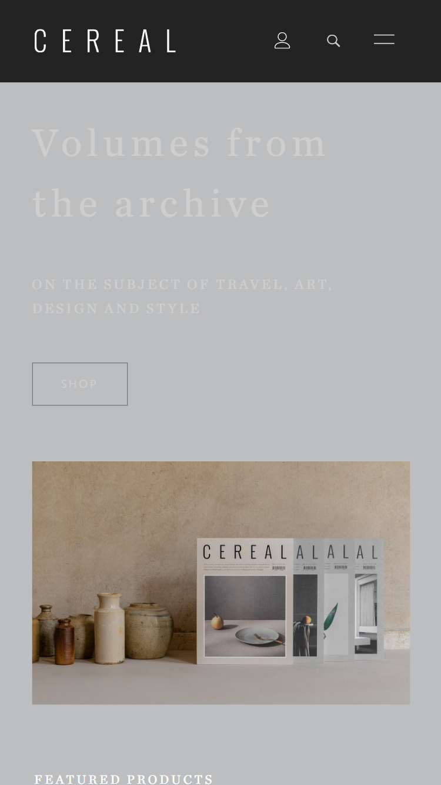
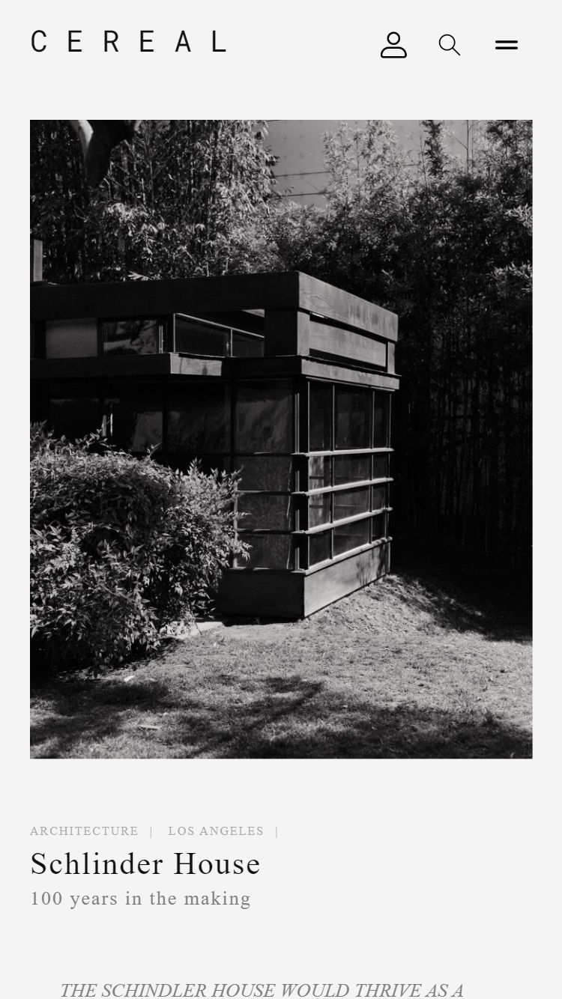
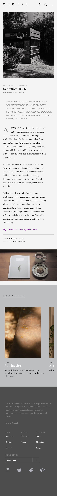
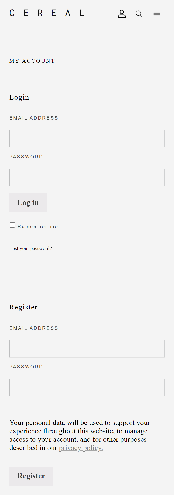
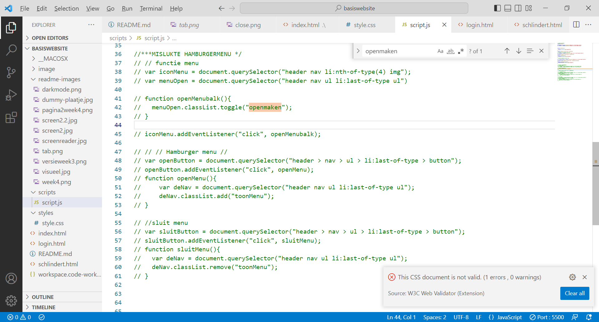

# Procesverslag
Markdown is een simpele manier om HTML te schrijven.  
Markdown cheat cheet: [Hulp bij het schrijven van Markdown](https://github.com/adam-p/markdown-here/wiki/Markdown-Cheatsheet).

Nb. De standaardstructuur en de spartaanse opmaak van de README.md zijn helemaal prima. Het gaat om de inhoud van je procesverslag. Besteedt de tijd voor pracht en praal aan je website.

Nb. Door *open* toe te voegen aan een *details* element kun je deze standaard open zetten. Fijn om dat steeds voor de relevante stuk(ken) te doen.

## Jij

  
uitwerken voor kick-off werkgroep

  ### Auteur:
  Aya Mokhtari 

  #### Je startniveau:
  blauw

  #### Je focus:
  surface plane
 

## Je website

  
uitwerken voor kick-off werkgroep

  ### Je opdracht:

 https://readcereal.com/

  #### Screenshot(s) van de eerste pagina (small screen): 
  Home pagina
  

  #### Screenshot(s) van de tweede pagina (small screen):
  Menu pagina 
   
  
  
 

## Toegankelijkheidstest 1/2 (week 1)

  
uitwerken na test in 1e werkgroep

  ### Bevindingen
  Tijdens het testen kwam ik verschillende bevindingen tegen. Deze heb achterhaald door met verschillende beperkingen de toegankelijkheid te testen. Hieronder wordt dat per categorie toegelicht.

  #### Screenreader
  Hier korte omschrijving (met indien nodig afbeeldingen)
  Als eerst heb ik de screenreader getest op de bestaande website van Cereal Magazine. Dit heb ik gedaan op de home pagina en de een artikel waarvan ik een verbeterde versie ga namaken.
  Om te beginnen met de home pagina. Deze bevat veel koppelingen en daardoor hoor je dat herhaaldelijk door de screenreader waardoor dit hinderlijk kan overkomen voor de gebruiker. Hij begint wel goed met voorlezen dat het een Cereal Magazine is en leest teminste wel alle onderdelen. Voor de rest ben ik wel tevreden want hij doet wat hij moet doen.
  De tweede pagina was veel fijner om naar te luisteren omdat er eer afwisseling was in wat er werd opgenoemd (i.p.v. steeds "koppeling .., koppeling .., etc. aan te horen). Hij stapte ook automatisch over naar een Engelse stem wanneer hij het artikel ging voorlezen. Ik hoorde alleen geen pauze of een rust moment wanneer hij oversprong naar een andere paragraaf waardoor het eentonig kan overkomen. Ook worden de aanbevolen artikelen netjes benoemd.

   

  #### Muis en Toetsenbord 
  De selectie met het 'TAB' knopje was visueel niet te zien. Er was niets te zien als een trassering om de selectie te onderscheiden van de andere content elementen. Als ik er iets positiefs uit kan halen is dat hij wel naar beneden scrolt wanneer de tab verspringt op een lagere content element. Ik zie wel dat de 'TAB' knop wel werkt omdat ik onderin de naam van de selectie te zien krijg.

  Hoe deze problemen opgelost kunnen worden is door kleur te gebruiken voor de omranding en de breedte van de lijn dik te maken. Ook wanneer die geslecteerd staat op een afbeelding moet de trassering zichtbaar zijn.

  

  

  #### Motoriek (shocks, elastiekjes)

  Motoriek is het beter te gebruiken dan verwacht omdat het op een klein scherm veel scrollen is en dat hoeft niet op een precieze manier. Ik heb deze beperking getest door m'n duimen en wijsvingers aan elkaar te elastieken. Ik merkte wel dat het vasthouden van de device zelf oncomfortabel is.

  #### Visueel (brillen, contrast, kleurenblind, dark/light).
  Ik denk dat mensen met minder zicht er het minst last van hebben op de home pagina omdat de afbeelding groot geschaald zijn. Het lezen van de artikellen gaat moeilijker door de lettergrootte. Ik heb dit met meerdere visuele beperkingen getest en de wazige bril was wel meest hinderlijke ervaring. De footer was een grote grijze blok door het vage contrast.

  De website heeft wel een dark mode die op een ding na het goed doet. De  featured products sectie was licht grijs en vooral in het donker erg verblindend. Ook de witte tekst erop maakt het lezen niet makkelijk. 
   

## Breakdownschets (week 1)

  
uitwerken na afloop 2e werkgroep

  ### de hele pagina: 
  

## Voortgang 1 (week 2)

  
uitwerken voor 1e voortgang

  ### Stand van zaken
  hier dit ging goed & dit was lastig (neem ook screenshots op van delen van je website en code)
  Ik heb een eerste versie van m'n html op de eerste pagina. Ook ben ik alvast gaan kijken naar custom properties en allemaal random kleuren gezet op de html elementen zodat ik goed weet of hij goed is geselecteerd.

  ### Agenda voor meeting
  samen met je groepje opstellen
student 1: Marc
- Algemeen, Hamburger menu, Github (vullen we het goed in, zoals website link).

student 2: Robin
- Is mijn HTML goed uitgewerkt? Of wat mist er nog of kan beter?
- Kun je grid, flexbox en position door elkaar gebruiken? Of kan het ook anders?

student 3: Aya
- Eigen website: hoe zijn hier de h'tjes verdeeld (h1, h2, etc.)?

student 4: Mats
- Planning opstellen voor huiswerk.

  ### Verslag van meeting
  hier na afloop snel de uitkomsten van de meeting vastleggen

  - punt 1: Zet alle figures in articles.
  - Metadata zet je in een footer, ookal staat het in een main (it's true:) 
  - punt 2: Logo > h1 , titel article > h2 , section met titel > h3 , feature products >h2 , ondertitel feature products > h2
  - splits de pagina op in sections en zet de titels hidden(display none).
  

## Voortgang 2 (week 3)

  
uitwerken voor 2e voortgang

  ### Stand van zaken
  hier dit ging goed & dit was lastig (neem ook screenshots op van delen van je website en code)

  Ver gekomen met het opstellen van de hele home pagina. De footer bij elk article wordt wel aangeroepen door een verkeerde selector dus daar moet ik nog aan werken. Ook de footer van de pagina moet ik nog opstellen.

  

  ### Agenda voor meeting
  samen met je groepje opstellen

  student 1: Marc
  - Geen specifieke vragen. Alleen kijken naar zijn code.

  
  student 4: Mats
  - Kijken naar haar website.

  student 3: Aya
  - Je kan de content veranderen zoals bijvoorbeeld een hamburgermenu img naar een kruisje door 'content: url()' in je css te zetten. Alleen hoe doe je dat als je geen https url hebt maar een svg afbeelding?

  student 4: Mats
  - Kijken naar zijn website.

  ### Verslag van meeting
  hier na afloop snel de uitkomsten van de meeting vastleggen

  - Antwoord op m'n vraag: je kan de verwijzing bij de url opschrijven zoals je het in een img tag aanroept.
  - Hulp gekregen hoe ik een afbeelding in een input kan zetten.
  - Nagevraagd of je een ul in een li kan zetten.En dat is toegestaan.

- ...

## Toegankelijkheidstest 2/2 (week 4)

  
uitwerken na test in 8e werkgroep

  ### Bevindingen
   Tijdens het testen kwam ik verschillende bevindingen tegen. Deze heb achterhaald door met verschillende beperkingen de toegankelijkheid te testen. Hieronder wordt dat per categorie toegelicht.

  #### Screenreader
  De screenreader vertelt wat de inhoud is van de pagina. Screanreaders worden voornamelijk gebruikt door blinden of slechtzienden en door het geluid kunnen ze de pagina volgen. Er zit ook een video in met geluid die ze kunnen beluisteren voor meer afwisseling. Ook verandert de stem van screanreader in een Engels accent zodra het artikel wordt voorgelezen. De onderdelen worden netjes voorgelezen alleen de navigatie balk met icon's loopt niet goed.

  #### Muis en Toetsenbord 
  Hier korte omschrijving (met indien nodig afbeeldingen)
  Door focus states toe te voegen kon ik goed aan de gebruiker laten zien waar die was gebleven. Alleen bij de a tags van de afbeeldingen is de omlijning er niet goed omheen geplaatst. Ik heb dit er bewust toch ingelaten omdat het wel een verbetering is tegenover de orinigele website. Verder zijn de inputs wel goed zichtbaar met een oranje trassering en de overige interactieve elementen.

  #### Motoriek (shocks, elastiekjes)
  Hier korte omschrijving (met indien nodig afbeeldingen)
  Op mijn pagina is het veel naar beneden of zijwaards scrollen wat fijn is voor mensen met een motorieke beperking.Alleen de footer en navigatie balk duurt langer om een precieze actie te ondernemen. Met het shock apparaat heb ik de testers opdrachten laten doen. Dit waren vooral formulieren invullen. De bevindingen daarvan waren dat ze het vermoeizaam was en het tik scherm groter mocht omdat het selecteren van het zoekveld lastig was. 

  #### Visueel (brillen, contrast, kleurenblind, dark/light). 
  Hier korte omschrijving (met indien nodig afbeeldingen)
  De website van cereal had een darkmode waarbij het contrast van de section niet fijn was om te lezen door de hoge helderheid. Ik heb dat wel opgelost in mijn eigen site met een keyframe waarbij ik andere kleuren heb gebruikt die worden gemanipuleert in de DOM. Wel had ik in het begin veel kleuren niet vanaf het begin in de :root gezet waardoor ik dat nog voor alle elementen moest aanpassen. Ik heb dit ook getest bij mijn klasgenoten en voor hen was het fijn te gebruiken. Ik was toen wel 1 kleur te vergeten aan te passen in de footer maar die heb ik nu ook weer aangepast. 

  
  

## Voortgang 3 (week 4)

  
uitwerken voor 3e voortgang

  ### Stand van zaken
 
  Home pagina
  
  Tweede pagina article
  

  ### Agenda voor meeting
  samen met je groepje opstellen

  student 1: Marc
 Snel door mijn code website heen kijken. Punt2 Vragen of mijn website voldoende variatie heeft. Punt 3 Mag ik var gebruiken als container rondom tags die wel syntax hebben.

  student 2: Robin
  1. mag ik een class gebruiken om een h1 visually hidden te maken
  2. responsiveness op mijn 2e pagina werkt niet helemaal
  3. is er genoeg variatie voor het service deel of moet ik nog meer toevoegen
  4. waarom ik maar op 1 button kan klikken en de andere buttons dan niet werken terwijl ze hetzelfde doen.

  student 3: Aya
  Hoe kan ik ervoor zorgen dat de p tag in de li ook mee wrapt en niet door elkaar heen lopen bij een zijwaardse scroll?

  student 4: Mats
  Vragen of het gebruik van div’s correct is.

  ### Verslag van meeting
  hier na afloop snel de uitkomsten van de meeting vastleggen

  - Antwoord op m'n vraag: white-space: break-spaces;
  - Ik weet nu hoe ik een zijwaardse scroll kan maken in css.
  - Probeer de twee pagina's meer divers van elkaar te maken.
  - Maak gebruik van DOM manipulatie.
  - De H1 wordt op de tweede pagina de titel van het artikel (schlindert House).

## Eindgesprek (week 5)

  
uitwerken voor eindgesprek

  ### Je uitkomst - karakteristiek screenshots:
  
  
  

  ### Dit ging goed/Heb ik geleerd: 
  Korte omschrijving
  Ik heb met dit vak veel geleerd over css elementen waarmee ik nooit had gedacht dat je er geen javascript voor nodig had. Ik vind het achteraf wel jammer dat ik wenig animaties heb gebruikt in m'n website zoals ik die heb gedaan in de huiswerkopdrachten. Ik ben iemand die niet snel te vreden is over m'n werk, maar ik moet zeggen dat ik wel trots bben op het eindresultaat. In het begin vreeste ik voor dit vak omdat ik er best wel moeite mee heb maar het is veel oefenen. Ik begon met de website van kapten & son in de eerste ander halve week en moest toen gaan switchen van website omdat de hele website was omgegooit in een blackfriday thema. In het begin vond ik dat erg jammer dat ik opnieuw moest beginnen, maar uiteindelijk was het makkelijker om een goed begin te maken van een website omdat je het al een keer hebt gedaan. 
  En DOM manipulatie zal ik ook standaard gaan gebruiken na dit vak want dat is werkt veel overzichtelijker (ook als je een darkmode eraan toevoegt wat ik heb gedaan).
  Ook ben ik trots op mezelf dat ik drie pagina's heb kunnen maken door nog een account pagina toe te voegen.

  ### Dit was lastig/Is niet gelukt:
  Korte omschrijving met plaatje
  Het is niet gelukt om een werkende hamburger menu te maken want ik wilde 2 microinteracties. Ik vind dat best wel lastig en eigenlijk wil ik mijzelf dit niet laten beperken door de tijd van de oplevering. Daarom zal ik er na dit gesprek later voor mezelf er nog eens aan zitten. En de ultieme goal was om het ook nog eens responsive te maken nadat ik me heb gefocust op de surfplane, maar dat was er helaas niet opgekomen. Ik kon daardoor ook niet veel met grid doen wat ik wel graag meer van wilde toevoegen aan m'n website. Wel weet ik nu door de huiswerk opdrachten hoe ik het kan toevoegen op toekomstige websites waardoor ik daar later meer mee kan experimenteren.

  

## Bronnenlijst

  
continu bijhouden terwijl je werkt

  Nb. Wees specifiek ('css-tricks' als bron is bijv. niet specifiek genoeg).

  1. bron 1: Hooft, ’t. (z.d.). Hamburger menu. Codepen. https://codepen.io/shooft/pen/dymRMBZ
  2. bron 2: Wikipedia-bijdragers. (2022, 8 maart). Schermlezer. Wikipedia. https://nl.wikipedia.org/wiki/Schermlezer
  3. bron 3: Pseudo-classes - CSS: Cascading Style Sheets | MDN. (2022, 11 oktober). https://developer.mozilla.org/en-US/docs/Web/CSS/Pseudo-classes 
  4. bron 4: Koning. (z.d.). Nieuwsbrief. Codepen. https://codepen.io/sasjakoning/pen/mdKvdae?editors=1100
  5. W3Schools (z.d) Slide in Overlay from the Top https://www.w3schools.com/howto/tryit.asp?filename=tryhow_css_image_overlay_slidetop

