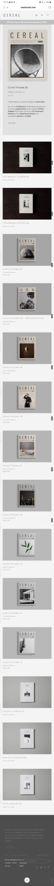
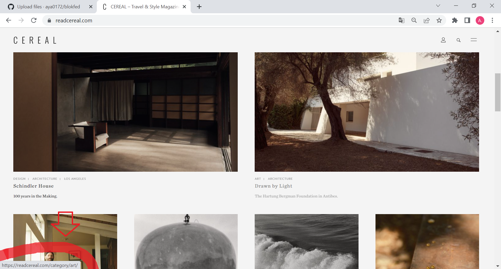

# Procesverslag
Markdown is een simpele manier om HTML te schrijven.  
Markdown cheat cheet: [Hulp bij het schrijven van Markdown](https://github.com/adam-p/markdown-here/wiki/Markdown-Cheatsheet).

Nb. De standaardstructuur en de spartaanse opmaak van de README.md zijn helemaal prima. Het gaat om de inhoud van je procesverslag. Besteedt de tijd voor pracht en praal aan je website.

Nb. Door *open* toe te voegen aan een *details* element kun je deze standaard open zetten. Fijn om dat steeds voor de relevante stuk(ken) te doen.

## Jij

  
uitwerken voor kick-off werkgroep

  ### Auteur:
  Aya Mokhtari 

  #### Je startniveau:
  blauw

  #### Je focus:
  surface plane
 

## Je website

  
uitwerken voor kick-off werkgroep

  ### Je opdracht:

 https://kapten-son.com/en

  #### Screenshot(s) van de eerste pagina (small screen): 
  Home pagina
  

  #### Screenshot(s) van de tweede pagina (small screen):
  Menu pagina 
  
 

## Toegankelijkheidstest 1/2 (week 1)

  
uitwerken na test in 1e werkgroep

  ### Bevindingen
  Lijst met je bevindingen die in de test naar voren kwamen:
  - Tijdens het testen kwam ik verschillende bevindingen tegen. 

  #### Screenreader
  Hier korte omschrijving (met indien nodig afbeeldingen)

  #### Muis en Toetsenbord 
  / bevindingen oude
  De selectie met het 'TAB' knopje was visueel niet te zien. Er was niets te zien als een trassering om de selectie te onderscheiden van de andere content elementen. Als ik er iets positiefs uit kan halen is dat hij wel naar beneden scrolt wanneer de tab verspringt op een lagere content element. Ik zie wel dat de 'TAB' knop wel werkt omdat ik onderin de naam van de selectie te zien krijg.

  Hoe deze problemen opgelost kunnen worden is door kleur te gebruiken voor de omranding en de breedte van de lijn dik te maken. Ook wanneer die geslecteerd staat op een afbeelding moet de trassering zichtbaar zijn.

  

  

  #### Motoriek (shocks, elastiekjes)

  Motoriek is het beter te gebruiken dan verwacht omdat het op een klein scherm veel scrollen is en dat hoeft niet op een precieze manier. Ik heb deze beperking getest door m'n duimen en wijsvingers aan elkaar te elastieken. Ik merkte wel dat het vasthouden van de device zelf oncomfortabel is. 
  Hier een omschrijving van hoe het opgelost kan worden (met indien nodig afbeeldingen)

  #### Visueel (brillen, contrast, kleurenblind, dark/light). 

  
  Hier een omschrijving van hoe het opgelost kan worden (met indien nodig afbeeldingen)

## Breakdownschets (week 1)

  
uitwerken na afloop 2e werkgroep

  ### de hele pagina: 
  

  ### dynamisch deel (bijv menu): 
  

  ### wellicht nog een dynamisch deel (bijv filter): 
  

## Voortgang 1 (week 2)

  
uitwerken voor 1e voortgang

  ### Stand van zaken
  hier dit ging goed & dit was lastig (neem ook screenshots op van delen van je website en code)
  Ik heb een eerste versie van m'n html op de eerste pagina. Ook ben ik alvast gaan kijken naar custom properties en allemaal random kleuren gezet op de html elementen zodat ik goed weet of hij goed is geselecteerd.

  ### Agenda voor meeting
  samen met je groepje opstellen
student 1: Marc
- Algemeen, Hamburger menu, Github (vullen we het goed in, zoals website link).

student 2: Robin
- Is mijn HTML goed uitgewerkt? Of wat mist er nog of kan beter?
- Kun je grid, flexbox en position door elkaar gebruiken? Of kan het ook anders?

student 3: Aya
- Eigen website: hoe zijn hier de h'tjes verdeeld (h1, h2, etc.)?

student 4: Mats
- Planning opstellen voor huiswerk.

  ### Verslag van meeting
  hier na afloop snel de uitkomsten van de meeting vastleggen

  - punt 1: Zet alle figures in articles.
  - Metadata zet je in een footer, ookal staat het in een main (it's true:) 
  - punt 2: Logo > h1 , titel article > h2 , section met titel > h3 , feature products >h2 , ondertitel feature products > h2
  

## Voortgang 2 (week 3)

  
uitwerken voor 2e voortgang

  ### Stand van zaken
  hier dit ging goed & dit was lastig (neem ook screenshots op van delen van je website en code)

  

  ### Agenda voor meeting
  samen met je groepje opstellen

  student 1: Marc
  - Geen specifieke vragen. Alleen kijken naar zijn code.

  student 3: Aya
  - Aya: Je kan de content veranderen zoals bijvoorbeeld een hamburgermenu img naar een kruisje door 'content: url()' in je css te zetten. Alleen hoe doe je dat als je geen url hebt maar een svg afbeelding?

  ### Verslag van meeting
  hier na afloop snel de uitkomsten van de meeting vastleggen

  - punt 1
  - punt 2
  - nog een punt
- ...

## Toegankelijkheidstest 2/2 (week 4)

  
uitwerken na test in 8e werkgroep

  ### Bevindingen
  Lijst met je bevindingen die in de test naar voren kwamen (geef ook aan wat er verbeterd is):

  #### Screenreader
  Hier korte omschrijving (met indien nodig afbeeldingen)

  Hier een omschrijving van hoe het opgelost kan worden (met indien nodig afbeeldingen)

  #### Muis en Toetsenbord 
  Hier korte omschrijving (met indien nodig afbeeldingen)

  Hier een omschrijving van hoe het opgelost kan worden (met indien nodig afbeeldingen)

  #### Motoriek (shocks, elastiekjes)
  Hier korte omschrijving (met indien nodig afbeeldingen)

  Hier een omschrijving van hoe het opgelost kan worden (met indien nodig afbeeldingen)

  #### Visueel (brillen, contrast, kleurenblind, dark/light). 
  Hier korte omschrijving (met indien nodig afbeeldingen)

  Hier een omschrijving van hoe het opgelost kan worden (met indien nodig afbeeldingen)

## Voortgang 3 (week 4)

  
uitwerken voor 3e voortgang

  ### Stand van zaken
  hier dit ging goed & dit was lastig (neem ook screenshots op van delen van je website en code)

  ### Agenda voor meeting
  samen met je groepje opstellen

  | student 1      | student 2          | student 3    | student 4        |
  | ---            | ---                | ---          | ---              |
  | dit bespreken  | en dit             | en ik dit    | en dan ik dat    |
  | en dat ook nog | dit als er tijd is | nog een punt | dit wil ik zeker |
  | ...            | ...                | ...          | ...              |

  ### Verslag van meeting
  hier na afloop snel de uitkomsten van de meeting vastleggen

  - punt 1
  - punt 2
  - nog een punt
  - ...

## Eindgesprek (week 5)

  
uitwerken voor eindgesprek

  ### Je uitkomst - karakteristiek screenshots:
  

  ### Dit ging goed/Heb ik geleerd: 
  Korte omschrijving met plaatjes

  

  ### Dit was lastig/Is niet gelukt:
  Korte omschrijving met plaatjes

  

## Bronnenlijst

  
continu bijhouden terwijl je werkt

  Nb. Wees specifiek ('css-tricks' als bron is bijv. niet specifiek genoeg).

  1. bron 1
  2. bron 2
  3. ...

